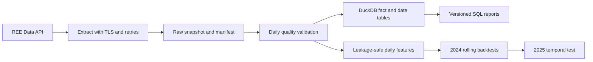
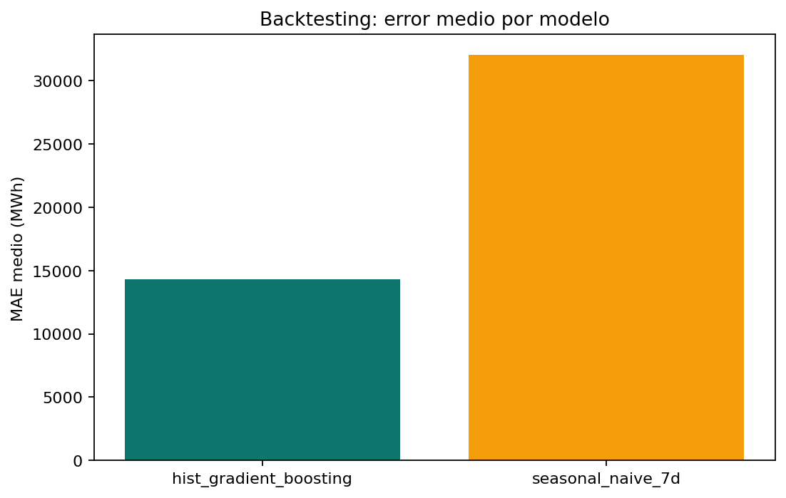
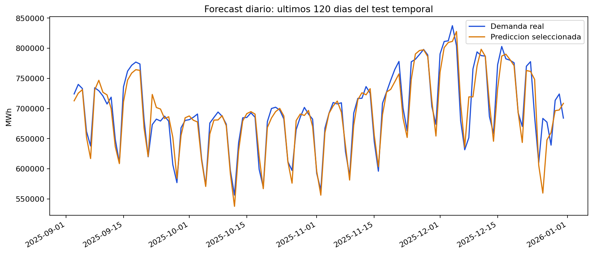

# Spain Electricity Demand Platform

Pipeline reproducible de ingenieria de datos y forecasting para analizar la demanda electrica diaria nacional de Espana. Extrae datos publicos de Red Electrica, los valida, los carga en DuckDB, ejecuta consultas SQL y compara forecasts diarios con validacion temporal.

## Pregunta

Como evoluciona la demanda diaria y que error obtiene un baseline semanal frente a un modelo de gradient boosting al predecir el siguiente dia? El proyecto es analitico y educativo: no sustituye la operacion ni la planificacion del sistema electrico.

## Fuente de datos

La fuente es la [API REData de Red Electrica](https://www.ree.es/en/datos/apidata). El endpoint `demanda/evolucion` admite rangos ISO 8601 y agregacion `day`; el pipeline consulta de 2019 a 2025 por defecto. Cada ejecucion guarda URLs, fechas, recuentos y SHA-256 en `data/raw/source_manifest.json`.

## Arquitectura



## Tecnologias

Python, pandas, DuckDB, SQL, scikit-learn, matplotlib, pytest, Ruff, Docker y GitHub Actions.

## Modelo de datos

- `fact_daily_demand`: demanda diaria en MWh y procedencia.
- `dim_date`: calendario diario.
- `mart_monthly_demand`: vista mensual.

Las consultas de tendencias mensuales, perfiles semanales, anos y dias pico estan en [sql/analytics.sql](sql/analytics.sql). Sus resultados se exportan a `reports/sql/`.

## Forecasting

Se trata de un forecast a un paso. Para la fecha `t`, los lags y medias moviles terminan en `t-1`. Se comparan:

1. `seasonal_naive_7d`: demanda observada siete dias antes.
2. `HistGradientBoostingRegressor`: calendario, lags 1/7/14/28 y medias moviles 7/28.

La seleccion se realiza por MAE medio en cuatro backtests de 28 dias durante 2024. El ano 2025 queda separado para la evaluacion temporal final. Se informan MAE, RMSE y sMAPE.

## Instalacion

```powershell
python -m venv .venv
.\.venv\Scripts\Activate.ps1
python -m pip install -r requirements-dev.txt
```

## Ejecucion

```powershell
python -m src.run_pipeline
```

El comando descarga los datos, genera tablas en `data/processed/`, construye `warehouse/electricity.duckdb`, ejecuta el SQL y deja los resultados en `reports/`. El archivo `.env` no se versiona; se puede partir de `.env.example` para modificar las fechas sin credenciales.

Alternativa con Docker:

```powershell
docker build -t spain-electricity-demand .
docker run --rm spain-electricity-demand
```

## Resultados

La ejecucion incluida consulto siete ventanas anuales de REE, desde el 1 de enero de 2019 hasta el 31 de diciembre de 2025. Se validaron 2.557 observaciones diarias consecutivas, sin dias ausentes ni fechas duplicadas, y se cargaron las mismas 2.557 filas en DuckDB.

El `HistGradientBoostingRegressor` fue seleccionado por MAE medio en cuatro ventanas de backtesting de 2024:

| Modelo | MAE medio backtest (MWh) | RMSE medio (MWh) | sMAPE medio |
|---|---:|---:|---:|
| HistGradientBoosting | 14.306 | 18.983 | 2,128% |
| Seasonal naive 7d | 32.012 | 41.840 | 4,641% |

En el test temporal no usado para seleccionar el modelo (todo 2025), HGB obtuvo MAE de **15.471 MWh**, RMSE de **23.036 MWh** y sMAPE de **2,259%**. El baseline semanal obtuvo MAE de 32.816 MWh y sMAPE de 4,738% en ese mismo periodo. Estos numeros describen este snapshot y no garantizan rendimiento futuro.





Las consultas SQL generaron 84 filas mensuales, 7 perfiles de dia de semana, 7 agregados anuales y los 20 dias de mayor demanda; estan disponibles en `reports/sql/`. Los CSV completos de backtest, test y predicciones quedan en `reports/`.

## Calidad y pruebas

```powershell
python -m ruff check .
python -m pytest
```

Los tests cubren ventanas de extraccion, parsing de formatos numericos, continuidad diaria, construccion sin fuga de lags, metricas y carga DuckDB. GitHub Actions ejecuta lint y tests en cada push o pull request.

## Limitaciones

- La demanda y su definicion dependen de la publicacion de REE y pueden ser revisadas.
- El modelo no incluye meteorologia, festivos detallados, precios ni actividad economica.
- Es una prediccion de un dia vista con datos historicos observados; no equivale a un forecast recursivo de varias semanas.
- Un error bajo no demuestra causalidad ni debe usarse sin validacion operacional adicional.

Consulta la explicacion completa en [docs/METHODOLOGY.md](docs/METHODOLOGY.md) y el esquema de campos en [docs/DATA_DICTIONARY.md](docs/DATA_DICTIONARY.md).

## Autor

Desarrollado por [0227lia](https://github.com/0227lia) como proyecto de portfolio de Ciencia de Datos.
