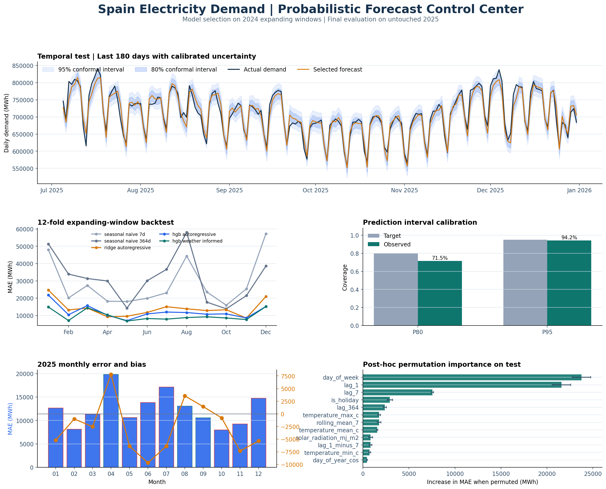
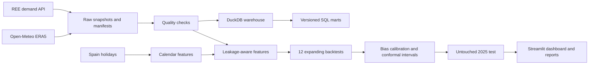
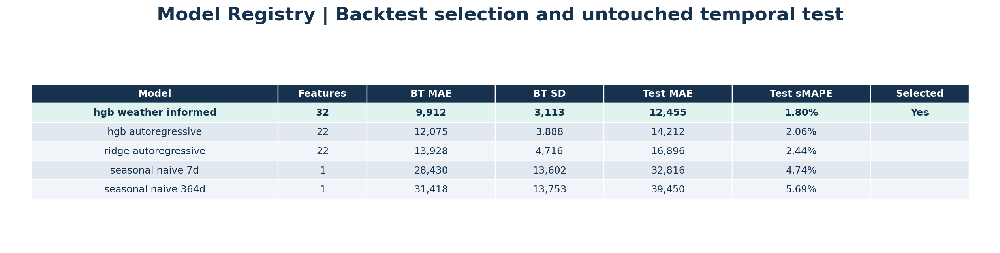

# Spain Electricity Demand Forecast Lab

[](https://github.com/0227lia/spain-electricity-demand-platform/actions/workflows/ci.yml)

Plataforma reproducible de ingeniería de datos y forecasting probabilístico para demanda eléctrica diaria española. Integra datos públicos de demanda, un proxy climático histórico, calendario nacional, DuckDB, SQL versionado, validación temporal, comparación estadística e interfaz interactiva.

No es un sistema de operación de Red Eléctrica ni una predicción de producción. Es un proyecto de portfolio con datos públicos, artefactos versionados y métricas generadas al ejecutar el pipeline.



## Pregunta

¿Cuánto mejora un modelo de demanda diaria que incorpora calendario, lags de consumo y clima frente a baselines estacionales simples, y qué tan bien se comportan sus intervalos de predicción en un periodo temporal no usado durante la selección?

## Datos y procedencia

| Fuente | Contenido | Snapshot incluido |
|---|---|---:|
| [REE Data API](https://www.ree.es/en/datos/apidata) | Demanda diaria nacional | 2.557 días, 2019-2025 |
| [Open-Meteo Historical API](https://open-meteo.com/en/docs/historical-weather-api) | ERA5 diario de Madrid, Barcelona, Valencia, Sevilla y Bilbao | 12.785 ciudad-días |
| [python-holidays](https://holidays.readthedocs.io/en/latest/api/) | Festivos nacionales españoles | Calendario determinista 2019-2025 |

El clima nacional se representa con una media de igual peso entre las cinco ciudades configuradas. Es un proxy reproducible para el ejercicio, no una medición oficial de temperatura media nacional. Cada fuente externa deja un manifest con URLs, fechas, recuentos y hashes SHA-256.

## Arquitectura



## Qué incluye

- Extracción con TLS, reintentos, snapshots y manifests reproducibles.
- Validación de continuidad diaria, duplicados, valores positivos, cobertura de ciudades y suma de pesos.
- Modelo de datos DuckDB con demanda, calendario, clima por ciudad, proxy climático y marts analíticos.
- Ocho consultas SQL: tendencia, perfiles de día, picos, clima, festivos y sensibilidad a grados-día.
- 32 variables del modelo seleccionado: calendario, festivos, lags 1/7/14/28/364, ventanas móviles, temperatura, lluvia, viento, radiación y grados-día.
- Cinco candidatos evaluados en 12 ventanas temporales expansivas de 28 días.
- Corrección de sesgo calculada solo con residuos fuera de muestra de 2024.
- Intervalos conformales 80% y 95%, cobertura observada y análisis de error por mes, día y régimen térmico.
- Diebold-Mariano con varianza Newey-West y bootstrap por bloques semanales contra el baseline de 7 días.
- Dashboard Streamlit con Plotly para explorar forecast, backtests, intervalos y SQL.

## Metodología de forecast

La tarea es un forecast diario a un paso. Para predecir el día `t`, los lags y medias móviles terminan en `t-1`; el calendario es conocido de antemano. Se usa 2024 para selección y calibración, con doce orígenes mensuales y ventanas de 28 días; 2025 queda aislado para la evaluación final.

Se comparan:

| Modelo | Variables | Papel |
|---|---:|---|
| Seasonal naive 7d | 1 | Baseline semanal |
| Seasonal naive 364d | 1 | Baseline anual por semana |
| Ridge autoregressive | 22 | Referencia lineal regularizada |
| HGB autoregressive | 22 | No lineal sin clima del día objetivo |
| HGB + weather | 32 | Modelo seleccionado; usa clima ERA5 realizado |

El último modelo usa clima ERA5 realizado del día objetivo como proxy de un forecast meteorológico disponible en producción. Es una hipótesis de investigación que puede sobreestimar el valor operativo; no se presenta como un backtest de previsiones meteorológicas históricas.

Consulta el detalle metodológico en [docs/METHODOLOGY.md](docs/METHODOLOGY.md) y los límites de uso en [docs/MODEL_CARD.md](docs/MODEL_CARD.md).

## Resultados reproducidos

El modelo seleccionado fue `hgb_weather_informed`, por menor MAE medio en los doce backtests de 2024. La corrección de sesgo de `+1.549 MWh` se aprende exclusivamente con 336 residuos fuera de muestra de esos backtests antes de tocar 2025.

| Modelo | MAE backtest medio | MAE test 2025 | sMAPE test |
|---|---:|---:|---:|
| HGB + weather | 9.997 MWh | 12.546 MWh | 1,82% |
| HGB autoregressive | 12.075 MWh | 14.212 MWh | 2,06% |
| Ridge autoregressive | 13.928 MWh | 16.896 MWh | 2,44% |
| Seasonal naive 7d | 28.430 MWh | 32.816 MWh | 4,74% |
| Seasonal naive 364d | 31.418 MWh | 39.450 MWh | 5,69% |

En el test aislado, el modelo seleccionado reduce el MAE un 61,8% frente al baseline semanal. El bootstrap de bloques de 7 días estima una ventaja de 20.270 MWh, IC 95% [16.044, 24.506]. El contraste Diebold-Mariano sobre pérdida absoluta da estadístico 8,97 y `p = 2,9e-19`; describe esta muestra temporal, no una garantía universal.

| Intervalo | Cobertura objetivo | Cobertura observada 2025 | Anchura media |
|---|---:|---:|---:|
| 80% | 80,0% | 72,1% | 30.992 MWh |
| 95% | 95,0% | 94,0% | 58.541 MWh |

La subcobertura del 80% es un resultado deliberadamente visible: los intervalos no se reajustan sobre el test para aparentar calibración perfecta.



## Dashboard

```powershell
streamlit run app.py
```

`Overview` compara demanda real, forecast e intervalos. `Backtests` muestra las doce ventanas y el registro de modelos. `Intervals` expone cobertura, error mensual y contraste estadístico. `Data` explora los marts SQL de clima y calendario.

## Instalación

```powershell
python -m venv .venv
.\.venv\Scripts\Activate.ps1
python -m pip install -r requirements-dev.txt
```

Las versiones numéricas están fijadas porque el artefacto `joblib` no garantiza compatibilidad entre versiones de scikit-learn, NumPy, SciPy, pandas y joblib.

## Ejecución

```powershell
python -m src.run_pipeline
streamlit run app.py
```

El pipeline descarga las dos fuentes, valida, escribe las tablas procesadas, construye `warehouse/electricity.duckdb`, ejecuta SQL, entrena los cinco candidatos y genera las figuras e informes.

Con Docker:

```powershell
docker build -t spain-demand-lab .
docker run --rm spain-demand-lab
docker run --rm -p 8501:8501 --entrypoint python spain-demand-lab -m streamlit run app.py --server.address 0.0.0.0
```

## Calidad

```powershell
python -m ruff check .
python -m pytest
```

La suite contiene pruebas de parsing, continuidad, extracción, clima, features sin fuga, intervalos conformales, bootstrap y carga DuckDB. GitHub Actions ejecuta lint y tests en cada pull request y en `main`.

## Estructura

```text
src/extract.py       demanda REE y manifiestos
src/weather.py       clima ERA5 por ciudad y proxy nacional
src/transform.py     calidad, calendario y features temporales
src/load.py          modelo DuckDB y marts
src/forecast.py      backtesting, calibración, intervalos y contraste estadístico
src/visualization.py informes de forecasting para README
app.py               dashboard Streamlit/Plotly
sql/                 consultas analíticas versionadas
reports/             predicciones, métricas, informes y figuras generadas
docs/                metodología, diccionario, model card y capturas
```

## Limitaciones

- Forecast a un paso con lags observados; no es un forecast recursivo de varias semanas.
- El clima ERA5 realizado no sustituye un archivo de previsiones meteorológicas emitidas antes de cada día objetivo.
- Los festivos son nacionales; no modelan calendarios autonómicos, locales, precios, actividad económica ni indisponibilidades.
- Los intervalos asumen que los residuos de 2024 son informativos para 2025; la cobertura 80% muestra que esta hipótesis no es perfecta.
- El modelo estima asociaciones predictivas, no causalidad ni decisiones de operación.

## Autor

Desarrollado por [0227lia](https://github.com/0227lia) como proyecto de portfolio de Ciencia de Datos.
